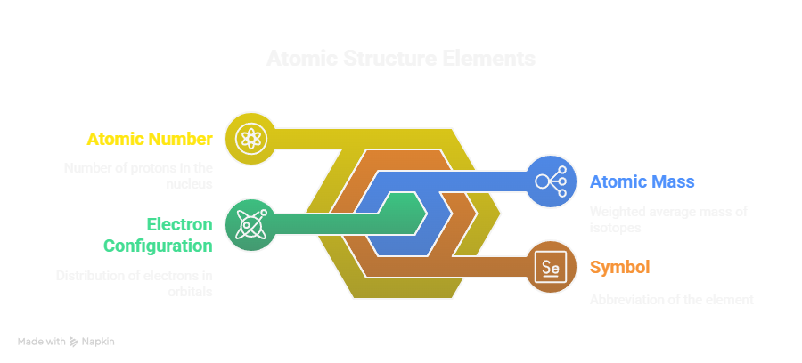

# Interactive 3D Visualization of the Periodic Table

This document outlines the design specifications for a high-resolution, interactive 3D visualization of the periodic table. The goal is to create an engaging and educational tool that allows users to explore the elements in a visually appealing manner while providing detailed information about each element.

---

## Design Overview

The periodic table will be represented as a series of distinct tiles, each corresponding to a different chemical element. The tiles will be color-coded based on the chemical category of the elements, such as:

- **Alkali Metals:** Light blue
- **Alkaline Earth Metals:** Light green
- **Transition Metals:** Yellow
- **Post-Transition Metals:** Orange
- **Metalloids:** Purple
- **Nonmetals:** Red
- **Halogens:** Dark red
- **Noble Gases:** Light purple

This color-coding will help users quickly identify the category of each element.

---

## Interactive Features

### Hover Effects

When users hover over a tile, the following detailed information will be displayed in a tooltip:

- **Atomic Number:** The number of protons in the nucleus of the atom.
- **Symbol:** The one or two-letter abbreviation of the element.
- **Atomic Mass:** The weighted average mass of the element's isotopes.
- **Electron Configuration:** The distribution of electrons in the atom's orbitals.

---

## Layout

The layout of the visualization will reflect the traditional periodic table structure, ensuring that users can easily navigate through the elements. The tiles will be arranged in rows and columns corresponding to the standard periodic table format, maintaining the relationships between elements based on their atomic numbers and properties.

---

## Technical Specifications

- **Resolution:** High-resolution graphics to ensure clarity and detail.
- **3D Rendering:** Utilize three.js technologies for rendering the 3D tiles.
- **Responsive Design:** The visualization should be adaptable to various screen sizes, ensuring accessibility on both desktop and mobile devices.
- **Integration:** The visualization will be designed for easy integration into web applications, for seamless user experience.

---

## Conclusion

This interactive 3D visualization of the periodic table aims to provide an engaging and informative experience for users. By incorporating color-coded tiles, hover effects, and detailed information, the tool will serve as an educational resource that enhances the understanding of chemical elements and their properties. The design will ensure clarity and usability, making it suitable for a wide range of audiences, from students to professionals in the field of chemistry.